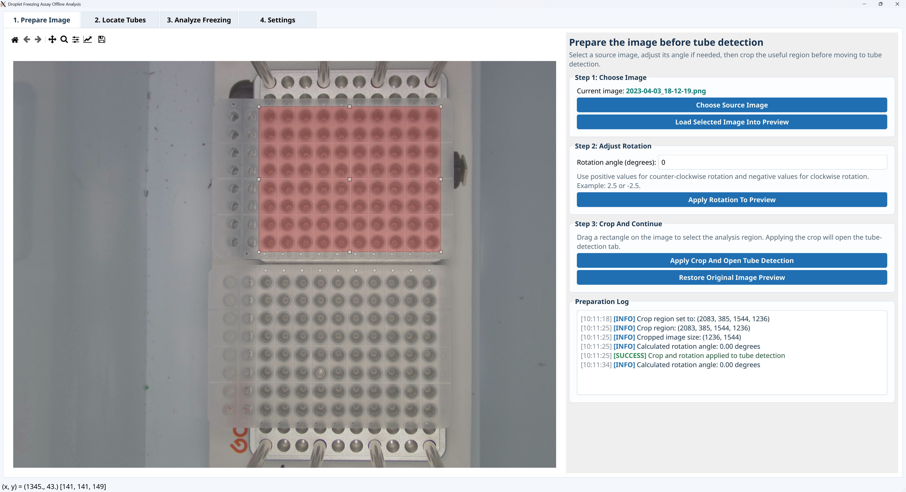
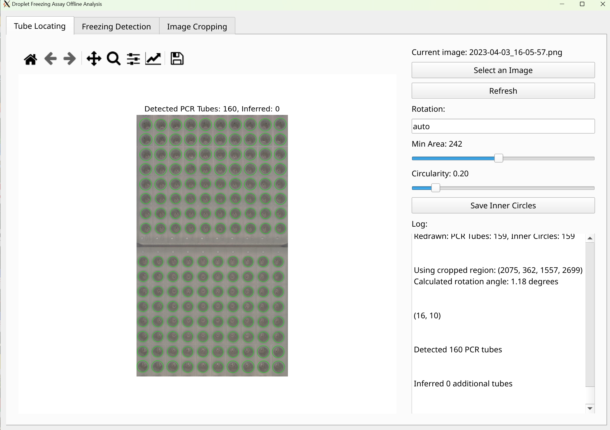
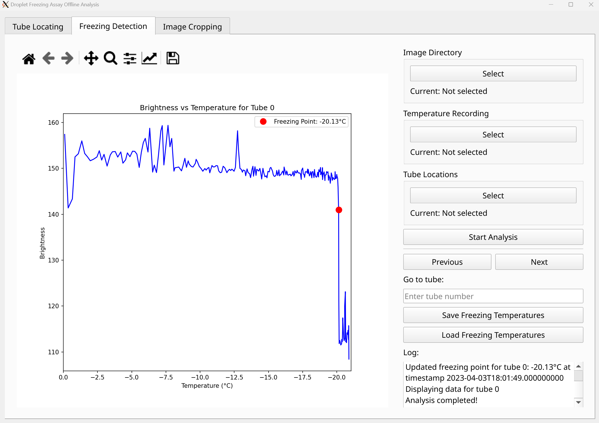
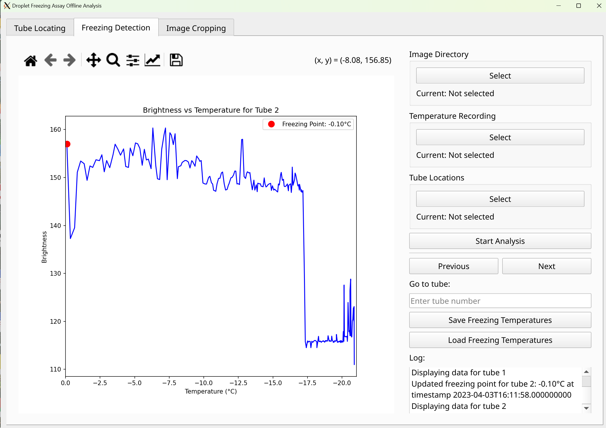
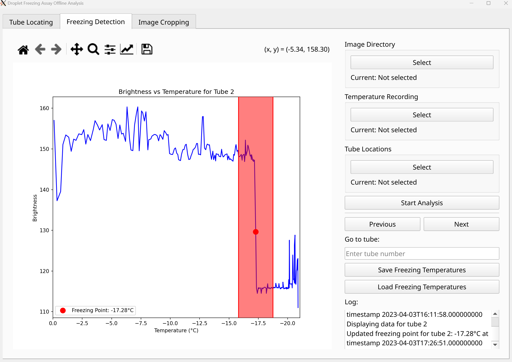

#+title: 冻滴实验软件使用说明
#+options: toc:nil
#+author:
#+date:
#+latex_compiler: xelatex
#+latex_class: ctexart
#+latex_class_options: [fontset=windows]
#+latex_header: \usepackage{dirtree}
#+latex_header: \usepackage{geometry}
#+latex_header: \setmainfont{Times New Roman}
#+latex_header: \setsansfont{Times New Roman}
#+latex_header: \setCJKmainfont{SimSun}
#+latex_header: \setCJKsansfont{SimSun}
#+latex_header: \setCJKmonofont{SimSun}
#+latex_header: \geometry{scale=0.8}
#+cite_export: biblatex authoryear

* 概述
当过冷水滴冻结时，由于溶解在水中的氧气无法及时逸出，会形成不透明的冰晶，这会在图像上表现为液滴亮度的变化。通过识别亮度变化的时间点，可以确定液滴冻结的温度。为此，我们需要完成以下步骤：
1. 确定各个液滴的位置
2. 获取液滴的亮度时间序列
3. 确定液滴的冻结温度

下面将详细介绍如何在本软件中进行这些操作。

* 液滴定位
程序可以自动检测PCR管的位置，从而定位液滴。定位完成后，将液滴位置数据保存以供后续使用。

为了提高定位的成功率，可以考虑以下操作：
1. 将两个PCR板对齐放置
2. 确保PCR板放置端正，没有旋转（尽管程序会尝试自动校正PCR板的旋转）
3. 裁剪图片区域，仅保留PCR板部分

下面分别说明图片裁剪和液滴定位的操作方法。

** 图片裁剪
1. 切换到 "Tube Locating" 标签页
2. 点击 "Select an Image"，通过文件选择窗口选中目标图片。我们假设在整个实验过程中液滴位置不会发生变化。通常选择液滴未冻结时的图片，因为此时亮度较高，更容易定位。
3. 切换到 "Image Cropping" 标签页
4. 点击 "Load Image" 加载图片，此时左侧画布上会显示该图片
5. 使用鼠标点按并拖拽，可以使用矩形选择工具框选目标区域。区域可以调整位置和大小。
   #+CAPTION: 选择裁剪区域
   #+NAME: fig:cropping
   
6. 完成后点击 "Apply Crop"，这将在 "Tube Locating" 标签页中应用对应的裁剪区域。

参考图 [[fig:cropping]] 。

** 液滴定位
完成裁剪后，回到 "Tube Locating" 标签，如果没有意外的话，可以在这里看到程序成功标注出了各个PCR板的位置。各个大圈中有较小的圆圈，标记出进行亮度采样的区域，我们只关注这个小圈的位置。

#+CAPTION: 液滴定位结果
#+NAME: fig:locating

参考图 [[fig:locating]] 。

如果未能显示图片，可以尝试：
1. 调节 "Min Area" & "Circularity" 两个数值。这两个数值控制了识别算法的阈值，有可能影响识别结果
2. 手动将液滴位置写入文件中

如果液滴识别位置有错：
1. 用鼠标左键点击错误的黑色圈，可以将其从液滴位置列表中移除
2. 用鼠标右键点击图片，可以将点击位置加入液滴位置列表

识别完成后，点击 "Save Inner Circles" 将液滴位置数据保存。

* 冻结温度识别
切换到 "Freezing Detection" 标签页，需要进行以下设置：
1. 实验过程中拍摄的图片保存目录的位置： "Image Directory"
2. 实验中温度记录文件的路径： "Temperature Recording"
3. 液滴的位置（参考上文）： "Tube Locations"

设置完成后，点击 "Start Analysis"，程序将自动读取相关文件，根据液滴的位置采样亮度并识别冻结温度。右下角的日志会显示识别进度。

#+CAPTION: 冻结温度识别设置
#+NAME: fig:detection-settings

参考图 [[fig:detection-settings]] 。

完成后，左侧画布上会显示第一个液滴的亮度曲线，并标注出冻结温度。这时需要逐个检查每个液滴的冻结识别是否正确。可以通过点击 "Previous" 和 "Next" 按钮逐个遍历液滴，也可以在 "Go to tube" 中输入液滴位置。

冻结时，液滴亮度会剧烈变化，并且前后呈现出两个平台的状态。如果冻结识别不正确，可以使用鼠标点击并拖拽，选择冻结发生的温度区间，程序会在该区间内修正冻结温度识别。

#+CAPTION: 亮度曲线和冻结温度标注
#+NAME: fig:brightness-curve

#+CAPTION: 修正冻结温度识别
#+NAME: fig:correction

参考图 [[fig:brightness-curve]] 和图 [[fig:correction]] 。

检验完所有温度后，点击 "Save Freezing Temperatures" 导出液滴的冻结温度。
