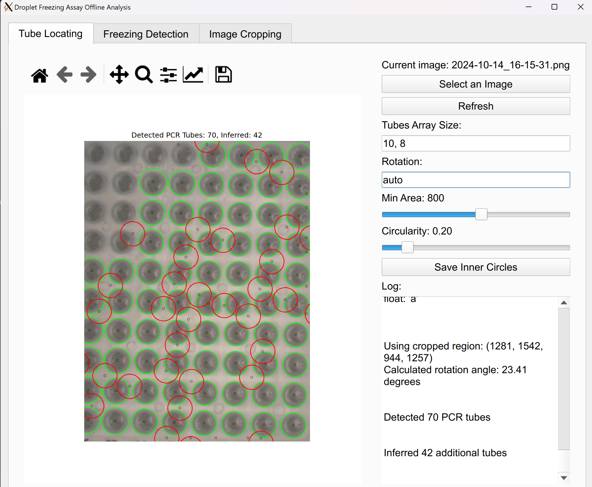

#+title: 冻滴实验软件使用说明
#+options: toc:nil
#+author:
#+date:
#+latex_compiler: xelatex
#+latex_class: ctexart
#+latex_class_options: [fontset=windows]
#+latex_header: \usepackage{dirtree}
#+latex_header: \usepackage{geometry}
#+latex_header: \usepackage{tcolorbox}
#+latex_header: \setmainfont{Times New Roman}
#+latex_header: \setsansfont{Times New Roman}
#+latex_header: \setmonofont{JetBrainsMono Nerd Font Mono}[Scale=MatchLowercase]
#+latex_header: \setCJKmainfont{SimSun}
#+latex_header: \setCJKsansfont{SimSun}
#+latex_header: \setCJKmonofont{SimSun}
#+latex_header: \geometry{scale=0.8}
#+cite_export: biblatex authoryear

* 概述
当过冷水滴冻结时，由于溶解在水中的氧气无法及时逸出，会形成不透明的冰晶，这会在图像上表现为液滴亮度的变化。通过识别亮度变化的时间点，可以确定液滴冻结的温度。为此，我们需要完成以下步骤：
1. 准备图片：选择参考图片、必要时旋转，并裁剪出需要分析的区域
2. 确定各个液滴的位置
3. 获取液滴的亮度时间序列
4. 确定并复核液滴的冻结温度

当前版本的软件主界面包含以下 5 个标签页，建议按照编号顺序操作：
1. =1. Prepare Image=
2. =2. Locate Tubes=
3. =3. Analyze Freezing=
4. =4. INP Concentration=
5. =5. Settings=

下面将按这一工作流介绍具体操作。

* 图片准备
液滴定位依赖一张参考图片。通常选择液滴尚未冻结时的图片，因为此时亮度较高，更容易定位。建议尽量满足以下条件，以提高后续定位成功率：
1. 两个PCR板尽量对齐放置
2. PCR板尽量保持端正；如果存在轻微旋转，可在软件中修正
3. 只保留PCR板所在区域，减少背景干扰

在 =1. Prepare Image= 标签页中依次完成以下步骤。

** 选择图片并加载预览
1. 切换到 =1. Prepare Image= 标签页
2. 点击 =Choose Source Image= ，选择用于定位液滴的参考图片
3. 点击 =Load Selected Image Into Preview= ，左侧画布将显示该图片

** 旋转和裁剪
1. 如有需要，在 =Rotation angle (degrees)= 中输入旋转角度
2. 点击 =Apply Rotation To Preview= 将旋转应用到预览图
3. 在左侧图片上用鼠标拖拽矩形，框选需要分析的区域。参考图 [[fig:cropping]] 。
   #+CAPTION: 选择裁剪区域
   #+NAME: fig:cropping
   [[file:fig1.png]]
4. 点击 =Apply Crop And Open Tube Detection= ，程序会将当前旋转和裁剪结果用于后续液滴定位，并自动切换到 =2. Locate Tubes= 标签页（该自动跳转行为也可在设置中关闭）
5. 如果希望重新开始，可以点击 =Restore Original Image Preview= ，恢复到原始图片并清除当前旋转、裁剪状态

#+begin_export latex
\begin{tcolorbox}
 tip: 可以分别框选每一个 PCR 板的区域单独进行识别，但要注意后续 =Tubes array size (rows, columns)= 必须与当前框选区域内的液滴排布一致
\end{tcolorbox}
#+end_export

* 液滴定位
程序会自动检测PCR管的位置，并给出用于亮度采样的内圆位置。定位完成后，需要将内圆位置保存下来，供冻结温度分析使用。

完成图片准备后，进入 =2. Locate Tubes= 标签页。如果没有意外，程序会自动基于裁剪后的图片执行一次识别。左侧画布中会看到各个PCR板的位置标记：大圈表示PCR管轮廓，小黑圈表示实际用于亮度采样的位置，我们主要关注小黑圈的位置是否正确。
参考图 [[fig:locating]] 。
#+CAPTION: 液滴定位结果
#+NAME: fig:locating
[[file:fig2.png]]

如果识别结果不理想，可以使用右侧 =Detection Settings= 中的参数重新识别：
1. 点击 =Run Tube Detection= 手动重新执行识别
2. 调节 =Min Area= 和 =Circularity= 。这两个数值控制识别阈值，会直接影响 PCR 管轮廓的筛选结果
3. 调节 =Tubes array size (rows, columns)= 。这里填写液滴阵列的行数和列数，程序会按该尺寸补全缺失位置，因此必须与实验布局一致
4. 调节 =Grid rotation= 。默认值 =auto= 会自动估计阵列旋转角度；如果自动估计失败，可手动输入角度，正值为逆时针，负值为顺时针

如果识别出的内圆位置有误，可以在左侧图中手动修正：
1. 用鼠标左键点击错误的黑色圈，可以将其删除
2. 用鼠标右键点击图片，可以在点击位置新增一个黑色圈

确认无误后，点击 =Save Inner-Circle Locations= 保存液滴位置数据。保存的是已经映射回原始图片坐标系中的内圆位置文件，后续在冻结分析中直接加载该文件即可。

#+CAPTION: 主成分分析失败的例子
#+NAME: fig:fail_pca

* 冻结温度识别与复核
切换到 =3. Analyze Freezing= 标签页，在 =Analysis Inputs= 中依次指定以下输入：
1. =Image Directory= ：实验过程中拍摄图片所在的文件夹
2. =Temperature Recording= ：实验的温度记录文件
3. =Tube Locations= ：上一步保存的液滴位置文件
4. =Temperature Cutoff Timestamp= ：温度记录的起始截断时间，格式为 =YYYY-MM-DD HH:MM:SS=

其中， =Temperature Cutoff Timestamp= 用于过滤温度记录文件中过早的时间点。程序只会保留时间戳大于或等于该值的温度数据，再与图像时间序列进行匹配。如果温度记录文件前面包含实验开始前的预热、准备或无关数据，应将这里设置为实际实验开始附近的时间。

设置完成后，点击 =Load Brightness Timeseries= 。程序会读取图片、温度记录和液滴位置，并先按照 =Temperature Cutoff Timestamp= 截断温度数据，再提取每个液滴的亮度时间序列，最后自动给出初始冻结温度识别结果。进度条会显示当前分析状态，右下角日志会显示详细进度和错误信息。

#+CAPTION: 冻结温度识别设置
#+NAME: fig:detection-settings
[[file:fig3.png]]

参考图 [[fig:detection-settings]] 。

分析完成后，左侧画布会显示当前液滴的亮度-温度曲线，并标出冻结点。此时需要逐个复核每个液滴的识别结果。可以使用以下控件：
1. =Show Previous Tube= 和 =Show Next Tube= ：查看前一个或后一个液滴
2. =Jump to tube number= ：输入液滴编号并回车，直接跳转到对应液滴。当前版本中的液滴编号从 0 开始
3. =Mark Current Tube As Not Available= ：将当前液滴标记为不可用。当某个液滴无法判断、没有有效数据，或者希望从后续统计中排除时使用。导出时该液滴会记为 =N/A= ，而不是 0

冻结时，液滴亮度通常会剧烈变化，并且前后呈现两个相对稳定的平台。如果自动识别不正确，可以直接在曲线上用鼠标横向拖拽，框选一个你认为冻结发生的温度区间，程序会在该区间内重新计算冻结点。参考图 [[fig:brightness-curve]] 和图 [[fig:correction]] 。

#+CAPTION: 亮度曲线和冻结温度标注
#+NAME: fig:brightness-curve
[[file:fig4.png]]

#+CAPTION: 修正冻结温度识别
#+NAME: fig:correction
[[file:fig5.png]]

复核完成后，可以在 =Import / Export= 区域进行结果保存和加载：
1. 点击 =Export Reviewed Freezing Temperatures= 导出当前复核后的冻结温度结果
2. 点击 =Import Saved Freezing Temperatures= 载入之前导出的结果，继续检查或修改
3. 如果希望直接生成 INP 曲线，可以点击 =Add Current Results To INP Plot= 。程序会弹出参数窗口，要求填写数据集名称、单滴体积和稀释倍数；确认后会自动导出当前复核结果，并切换到 =4. INP Concentration= 标签页

* INP 浓度曲线对比
=4. INP Concentration= 标签页用于根据冻结温度结果计算累计 INP 浓度曲线，并将多个数据集画在同一张图中进行比较。左侧画布显示曲线，右侧用于添加和管理数据集。

INP 曲线的计算依赖三个信息：
1. 每个液滴的冻结温度
2. 单滴体积 =Droplet volume= ，单位为微升（uL）
3. 稀释倍数 =Dilution factor=

可通过以下 3 种方式向 INP 图中添加数据：
1. 点击 =Add Freezing Temperatures File= ，加载一个或多个已经导出的冻结温度文本文件
2. 在下拉框中选择示例数据后点击 =Add Preset= ，快速查看内置示例曲线
3. 点击 =Add Current Results From Analyze Freezing= ，直接使用当前 =3. Analyze Freezing= 标签页中已复核的结果

无论使用哪种方式，程序都会先弹出一个参数窗口，需要确认：
1. =Dataset label= ：曲线在图例中的显示名称，可按样品名、批次名等填写
2. =Droplet volume= ：单个液滴体积；如果不确定，可先在 =5. Settings= 中设置默认值
3. =Dilution factor= ：样品相对原液的稀释倍数；未稀释时通常填 1

添加完成后，曲线会立即显示在左侧图中，图例中同时会标注该数据集包含的液滴数量。需要注意：
1. 纵轴为对数坐标，表示累计 INP 浓度
2. 横轴为冻结温度，图中会按温度从高到低显示
3. 如果输入文件中某些行格式不正确，程序会跳过这些行，并在右下角 =INP Log= 中记录警告

右侧 =Loaded INP Datasets= 区域用于管理已加载的数据：
1. 点击某个数据集后，可使用 =Remove Selected Dataset= 删除单条曲线
2. 点击 =Clear All Datasets= 可一次清空当前图中的所有数据集
3. 右下角 =INP Log= 会显示添加、删除、清空以及读取异常等详细信息

如果只是想比较不同样品或不同实验批次的 INP 曲线，通常建议先在 =3. Analyze Freezing= 中完成复核并导出冻结温度，再统一在本页加载和比较。

* 设置
=5. Settings= 标签页用于调整一些默认行为，不影响核心分析流程，但在重复处理数据时会更方便。常用选项包括：
1. 设置液滴定位的默认参数，例如默认阵列尺寸、默认旋转方式、默认最小面积和默认圆度阈值
2. 控制是否自动记忆上一次选择的输入文件和文件夹
3. 设置 INP 计算的默认单滴体积和默认稀释倍数
4. 控制在完成裁剪后是否自动切换到 =2. Locate Tubes=
5. 查看界面快捷键，并调整界面字体大小

如果只是完成冻结温度识别，通常按前 3 个标签页顺序操作即可；如果还需要比较累计 INP 浓度，再继续使用第 4 个标签页。
